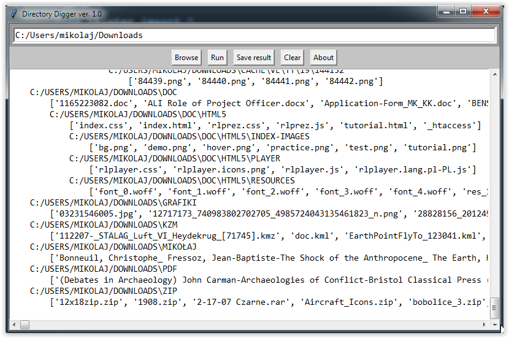

Directory-Digger
===============
This repository hosts a simple program made to list directory tree and save it to a txt file.

You can launch Directory Digger directly using DirectoryDigger.py or DirectoryDigger.exe

License
-------
Directory-Digger is licensed under the GPLv3.
