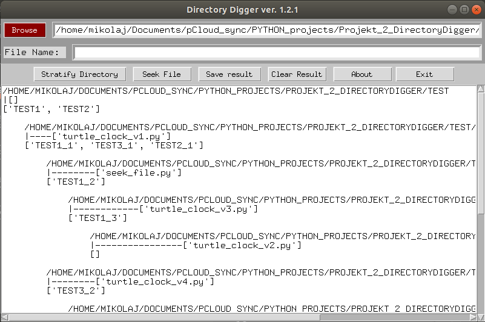
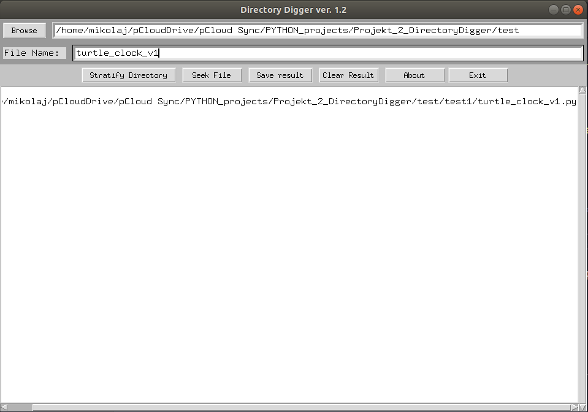
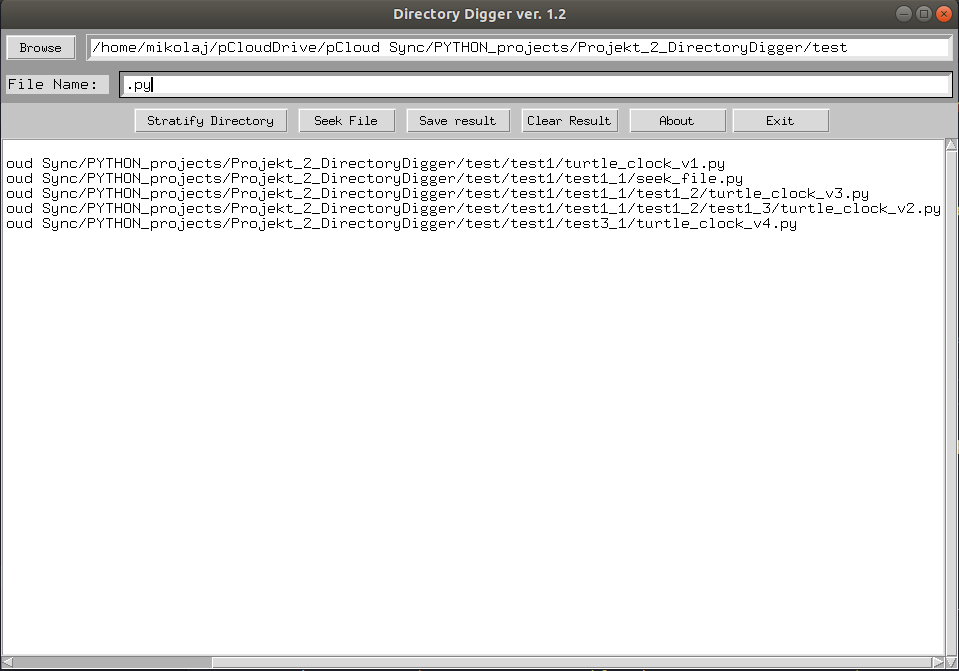

Directory-Digger
===============
This repository hosts a simple program made to list directory tree and save it to a txt file.

You can launch Directory Digger directly using app.py (ver. 1.2) or <a href="https://github.com/kostyrko/Directory-Digger/tree/master/dist">DirectoryDigger.exe<a/> -> ver 1.1.2 (loacation: Directory-Digger/dist/)

License
-------
Directory-Digger is licensed under the GPLv3.
